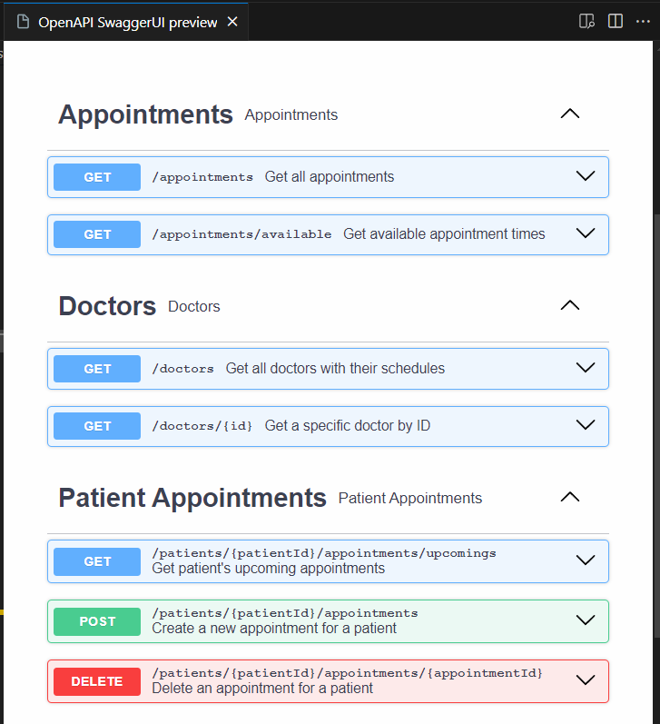

# 🚀 Appointment Scheduling App

## App


## Getting Started

### Prerequisites

Ensure you have the following installed:

- PHP (`>=8.3`)
- Composer
- MySQL
- Node.js (`>=22`)
- npm (`>=10.8`)
- Laravel (`>=10.x`)

### 📦 Installation

#### 1️⃣ Clone the repository

#### 2️⃣ Install dependencies
```
composer install
```

#### 3️⃣ Set up environment
```
cp .env.example .env
php artisan key:generate
```

#### 4️⃣ Configure database
- Update .env with your database credentials.
- Run migrations:
```
php artisan migrate --seed
```

#### 5️⃣ Start the development server
```
php artisan serve
```

#### 6️⃣ Visit the login page to start
Go to http://127.0.0.1:8000/patients

### 📋 App Configuration Files

1. **`appointment_types.php`**  
   This file defines the types of appointments allowed in the system. It contains a list of available appointment types, including their durations and any other relevant details.

2. **`appointments.php`**  
   This file contains general settings related to appointments.
   - **`appointment_interval`**: Specifies the minimum time interval (in minutes) between appointment start times.
   - **`default_number_of_days`**: Defines the default number of days used when fetching available appointment slots for users.

3. **`doctors.php`**  
   This file contains the profiles of the doctors, including:
   - **Doctor Details**: Name, contact, etc.
   - **Working Schedule**: A list of working days and hours for each doctor. This is used to determine when the doctor is available for appointments.

### 📋 Swagger Doc
You can find it under /storage/api-docs/api-docs.json
Install Swagger Viewer on VSCode to view it.

